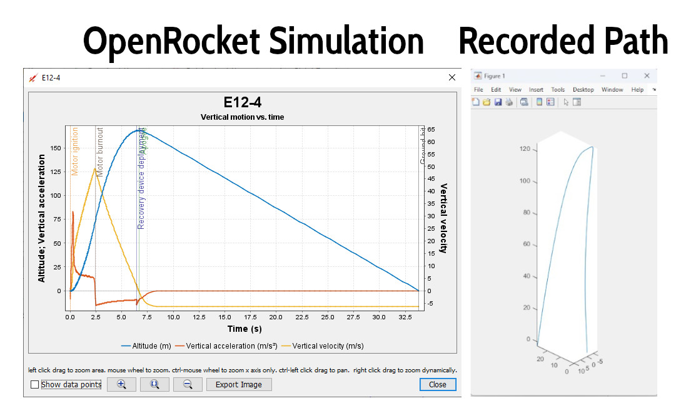

# Model Rocket Flight Control Computer
#### Servo-based flight control providing active stability and data logging for model rockets.

## Project Scope

This project is intended to provide hobbyists, academics, and model rocket teams with an understandable yet feature-rich open-source flight computer design utilizing servo-driven active stability and data logging capabilities. Block diagrams, schematics, source code, and engineering philosophies behind the design are all provided for anyone interested in model rocketry. Readily available consumer parts have been selected for the electronics and hobbyist rocket kits chosen with 3D-printed modifications added for ease of construction. The design is modular and made to be easily customized and edited, and also intended to be usable for steerable canards, tail fins, or thrust vector control (however, the latter two have not yet been tested). The implemented flight stability keeps the rocket pointed vertically by steering away from gravity, but does not allow any form of targeting or guidance to a target. 

To make this project hands-on and iterative, some unconventional decisions have been made that readers should be aware of, such as: choosing and constructing a theoretically conservative steering design using static modeling instead of fully modeling flight dynamics beforehand; using sensor fusion output that is not meant for thrust for the initial steering design, which is expected to need replacement under high-g forces; and using protoboard and CNC-milled PCB prototypes which are bulkier than factory-fabricated PCBs but allow rapid testing and design changes. It is my intent to continually analyze flight recordings to characterize the steering of different airframes and implement different state-space models to enhance the steering over time.

## Versioning

The project scope is divided into versions which contain an increasing number of features on varying rocket airframes. Currently, V1 and V2 are completed and have flight data recorded from numerous launches to analyze the active flight control behavior. Future versions with additional features are planned:

- V1 - ✓ - (Open-Source and Completed): Functional Flight Computer with BNO055 IMU, active vertical-flight steering fin control, and data logging to SD Card for flight analysis on a BT-60 Estes Green Eggs airframe. [An academic paper](https://ieeexplore.ieee.org/document/11267717) regarding the engineering of this V1 rocket has been published and presented at IEEE UEMCON 2025, which includes additional details.
- V2 - ⧗ - (Open-Source and Completed, Preparing GitHub Documentation): Barometer, battery charger, GPS, SDIO SD recording, LoRa, a ground station, and interrupt-driven steering added. A new 3-inch PCB and Apogee Mako rocket design were built and flown. 
- V3 - ☐ - (Undecided): 66mm rocket airframe with servo-controlled tail fins for additional data collection.
- V4 - ☐ - (Closed-Source): Fly-to-location and/or fly along trajectory features to simulate real-world requirements of high-powered rockets to exit the atmosphere and enter orbit along predetermined flight paths.

Later advanced versions of this flight computer software will be private and the source code will be closed. If you wish to collaborate on more advanced and legal rocket designs or custom-made computers for your use case, please feel free to contact me.  

#### V2 Rocket and Flight Computer

## V1 Design Overview

The first milestone (V1) was to complete onboard flight control for vertical-up active flight guidance to continuously steer a model rocket directly away from Earth. This required creating a flight computer, flight computer software, and model rocket hardware. The flight computer hardware and software design blocks may be seen in the image below:

### V1 Flight Computer

Prior to designing and constructing the rocket, an RP2040 was selected to become the flight computer and a Pi Pico was implemented. A fast clock speed, multiple cores, and PIO ports were main considerations when selecting this microprocessor. The microprocessor was breadboarded with various sensors, an SD card, and servos. When software progressed far enough to provide proof of concept on breadboard, rocket construction began and the flight computer moved from a breadboard to a soldered protoboard and 3D-printed solution. Since the flight computer is 3.3v, a simple passive SD card to MicroSD adapter allowed jumper wires to be soldered directly to it in order to connect the flight computer directly to the MicroSD card used to log data. 

#### V1 and V2 Flight Computers

### PIO Usage

The PIO ports of the RP2040 proved to be especially useful in servo control, as servos require exactly timed pulses in an approximate range of 1ms to 2ms to set their position. Using PIO, 4 state machines were created with their timings running independently of the core process without using interrupts, ensuring the fins will hold their exact set positions with consistent servo pulse timing regardless of the status of the main program. Positional changes of the fin are achieved by sending a new pulse timing delay to a corresponding servo's PIO register. Steering changes do require the core program to compute data and send updates, and therefore requires the processor to be looping through the program very quickly to provide smooth steering. V2 changes to the program involved moving the IMU polling and servo setting required to actively steer the rocket to an interrupt-driven program flow to provide continuously smooth active steering, regardless of the processor's looping speed.

To initially understand PIO implementation and the assembly code required to program it, active LED control was written for a yellow Status LED and red Recording LED as a PIO state machine program. The speed at which the LEDs flash gives the rocket operator insight into the rocket's current state and readiness for launch. As these LEDs are not time critical and can be easily controlled through polling in the main program, and only two different state machine programs may be implemented on an RP2040 at once, in later software versions this LED PIO state machine has been repurposed to accommodate D0-D3 SDIO style SD card saving, increasing the speed at which flight information can be saved.

### V1 Rocket Design

V1 of the rocket is built using a modified Estes Green Eggs model rocket kit. To establish the design, OpenRocket software was used to model simple flight characteristics of the rocket, such as Center of Gravity (CoG) and Center of Pressure (CoP), as well as to run simulations on expected flight dynamics with different Estes engines. An OpenRocket savefile containing a model of the stock Green Eggs rocket kit created by user BEC was downloaded from [rocketryforum.com](https://www.rocketryforum.com/threads/openrocket-or-rocksim-file-for-estes-green-eggs.182309/) and compared with the physical V1 rocket under construction. Minor adjustments to the existing design were made to match the V1's build, and then additional modules for flight control, sensors, and active steering were modeled into the design. As OpenRocket is designed with uncontrolled static-fin rockets in mind, steering dynamics could not be directly simulated. However, fin location vs Cog and CoP were observed for numerous modeled configurations and a design was decided on to test a flight control design implementation. 

### V1 Servo Housing and Steering Fins

After modeling the flight characteristics and deciding on a location for servos and steering fins, a 3D model for a servo housing was created in Fusion360. A design for directly mounting the flight control fins to the servos without any additional linkage was decided on for simplicity and to save space. The servo housing is located between the engine and parachutes, requiring it to withstand the parachute ejection charge forces coming from the engine and allowing this force to pass through, ejecting the nose of the rocket and deploying the parachute without damaging the servos or housing. After deciding on servo positions in the housing, multiple vertical holes with beveling were added to the design to allow delivery of the parachute charge. This housing was then 3D-printed in PLA and permanently fixed inside the rocket's body tube using epoxy. The openings were cut out of the sides of the rocket body and the servos installed. The servo wires were routed vertically into the rocket body tube, and all the end connectors were removed. Two new and larger end connectors were used and fixed together to create a single break-away connector for all 4 servos. 

Steering fins were 3D modeled in Fusion360 to match the OpenRocket design used to model flight. Metal wires were glued into the center of the servo connector nubs to provide more support than just friction fitting the fin over the servo connector nubs. These semi-rigid wires pass all the way through the fin and are bent over at the tops of the fins to retain them and have proven effective in providing support, as fins have never come off in flight (but have in landing, and have been easily recovered in immediate proximity to the rocket and reinstalled without the glue being necessary). 

### V1 Sensor Puck

A puck-shaped sensor housing was designed in Fusion360 to house the BNO055 IMU and PA1616D GPS module. The sensor modules screw into the 3D-printed PLA housing and the entire assembly slides into the clear green tube holding the flight computer. The puck's shape ensures proper IMU sensor orientation and avoids sensor misalignment with the rocket. The GPS is positioned on the top of the puck (also above the flight computer) with a relatively unobstructed view of the sky to promote good signal reception. Two switches are also installed into the puck for user controls. One switch turns battery power to the flight computer on/off, and the other begins recording data to the SD card. Turning data recording off and then on again begins a new recording file. It would be ideal to add both a USB port and boot button for programming the RP2040 as well as access to the SD card through the top of the puck, however due to space constraints this may or may not be feasible in future revisions.

### V1 Flight Computer Software

The software is divided into two sections: PIO state machines and a main C program. The state machines and C program run independently of each other and interact through registers which change the behavior of the PIO state machines. In V1 the PIO state machines control the LEDs and servo pulses using a delay number, and each PIO state machine monitors its input register to accept a new delay number (in 125MHz clock ticks). The rest of the V1 software is a C program with polling-based timer design to retrieve data from sensors, record data to SD card, and set LED timing and servo positions through the PIO registers. Due to time constraints of getting V1 results only the BNO055 IMU, SD card, LEDs and Servos are fully implemented in V1. 

The BMP390 barometer planned for use has a complicated initialization process, and in V1 software enabling oversampling to improve data consistency currently prevents further data retrieval from the unit. Until the initialization coding for using the barometer is corrected, it remains physically uninstalled from the rocket.

The PA1616D GPS module is installed in the rocket's sensor puck and connected to the flight computer, however communication over UART with the GPS is relatively slow and must be parsed in full, instead of retrieving specific data on-demand as with the IMU. With the current V1 software implementation, receiving this GPS UART data causes the looping of the main C program to iterate slow enough to cause stuttering in the control fin steering. Due to potential steering stuttering, GPS data retrieval is currently disabled in V1. Planned fixes to this include moving the IMU data retrieval and steering fin PIO register control to an interrupt-based timer format, rather than polling. This will allow more freedom in dealing with slower loop iterations and parsing the UART data while having smooth steering control at all times. In addition, moving the UART parsing to an interrupt-based format may also be implemented to reduce polling UART when unnecessary. 

The SD card currently saves at 10Hz. More frequent logging is desired, however saving more often over SPI in V1 causes steering stuttering similar to using GPS UART. Interrupt-based solutions for IMU data and steering fin control are expected to help with this, and additionally moving from SPI-based saving to parallel D0-D3 SDIO communication through a PIO state machine should allow higher speed interface to the SD card. [carlk3's github library no-OS-FatFS-SD-SDIO-SPI-RPi-Pico](https://github.com/carlk3/no-OS-FatFS-SD-SDIO-SPI-RPi-Pico) is used to interface to the SD card over SPI and will continue to be used for SDIO interfacing. 

The BNO055 IMU in V1 is set to an NDOF mode, using a sensor fusion of the accelerometer, gyroscope, and magnetic sensor provided to a Kalman filter to output very stable data. This filtered data provides a gravity vector for each axis, which are used in steering. In an ideal vertical state, the gravity vector for the Z axis is 9.8, and the gravity vectors for both the X and Y axes are 0. This ideal state would have the rocket nose pointed straight away from the Earth. As the rocket tips sideways, the gravity vectors for X and Y increase/decrease and Z decreases. This non-ideal variation from 0 in X and Y is directly used to control the servo pulses for the related steering fins, correcting the rocket's flight to become more vertical. These gravity vectors, along with acceleration vectors, time, heading, and temperature are all collected from the IMU and saved to the SD card to later reconstruct the rocket flight path to analyze performance. 

It is important to note that while this steering method has been working on low-power rockets (currently up to 7.5 g), the BNO055 gravity vectors are not expected to remain reliable under more extreme acceleration. The BNO055 was not designed to be used under high thrust and a new filter method is expected to be necessary for high-powered flight. Out of curiosity, I will continue to push the sensor to its limits with an emphasis on maintaining safety during launches, while simultaneously developing new state-space models for steering to replace the sensor's built-in gravity vector method. 

The servos use a PIO assembly program which monitors the attached servo's state machine register for a delay number. This delay number is used to count down system clock ticks to produce a high pulse between approximately 1-2ms in duration, which corresponds to the two steering extremes of the servo. The countdown is then multiplied by 10 when the output goes low to generate a 100-200Hz high/low pulse cycle desirable for servo control. Once a delay is received, the state machine is able to deliver consistent pulse timing to the servos, completely independent of the C program, delivering consistent fin positioning regardless of overall program state. Only further steering changes are dependent on the C program writing new values to the state machine's input register. In V1, the LEDs use a very similar program to blink on and off at different speeds, informing the operator of program status.

## Collected Flight Data

At the time of this publication V1 has 9 flights logged, and V2 has 3 flights logged (and one more flight without electronics enabled). Using acceleration and gravity data without additional positional or altitude data has been problematic to reassemble into flight paths, but progress has been made. There is also unexpected IMU heading direction behavior at certain angles that needs to be understood and compensated for. Despite these difficulties, some flights have been successfully mapped by processing the acceleration, gravity, and heading data through MATLAB and then integrating into velocity and positional data. One flight path is shown modeled below, along with the OpenRocket simulation of the expected flight. While the rocket did not reach the full height modeled, the real-world data which was collected and mapped is still close to the simulated projection, with the parachute charge deploying very near apogee when expected.

With the inclusion of barometer data from V2 onward, the flights are becoming easier to map and characterize.

